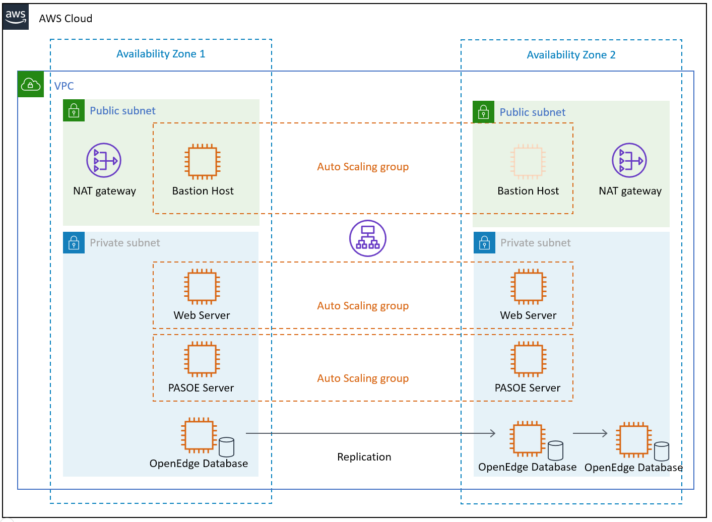
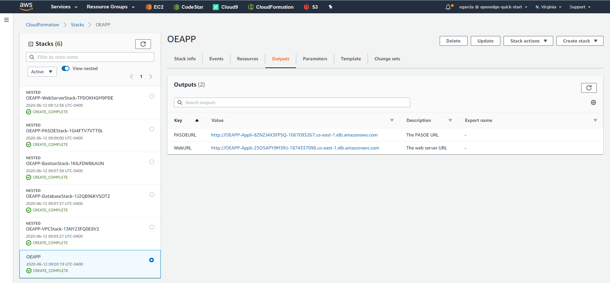

OpenEdge on the AWS Cloud

Quick Start Reference Deployment

<Month> 2020

Edsel Garcia, Progress Software

Dave May, AWS Quick Start team

____________________________________________________________________
Visit our GitHub repository for source files and to post feedback, +
report bugs, or submit feature ideas for this Quick Start.
____________________________________________________________________

This Quick Start was created by Progress Software in collaboration with Amazon Web Services (AWS).

http://aws.amazon.com/quickstart/[Quick Starts] are automated reference deployments that use AWS CloudFormation templates to deploy key technologies on AWS, following AWS best practices.

[[overview]]
= Overview

[[_Toc466884484]]This Quick Start reference deployment guide provides step-by-step instructions for deploying OpenEdge on the AWS Cloud.

[[_Toc481076926]]This Quick Start is for users who want to deploy a multi-tier OpenEdge application using PAS for OpenEdge on the AWS Cloud.

[[openedge-on-aws]]
== OpenEdge on AWS

The OpenEdge on AWS Cloud is a convenient way to create the infrastructure required to run an n-tier OpenEdge ABL application with a Web UI, REST data services and the OpenEdge database. It combines the AWS services and the OpenEdge functionality to achieve high availability, redundancy and scalability.

You can use the Quick Start CloudFormation template interactively to create a new infrastructure or use the CloudFormation CLI to automate deployments of OpenEdge applications from a CI/CD pipeline.

The template uses user-provided deployment packages for the Web server, PAS for OpenEdge and the OpenEdge database so that the components are ready to run after the creation of the infrastructure. You can package your on-premises application using this approach to easily deploy it to the AWS cloud.

The Web server and PAS for OpenEdge dynamically download and install the latest version of the package when the EC2 instances are created. This can be used rollout new versions of the application if desired.

The configuration for the database can use OpenEdge Replication Sets or any other approach to provide redundancy.

[[cost-and-licenses]]
== Cost and licenses

You are responsible for the cost of the AWS services used while running this Quick Start reference deployment. There is no additional cost for using the Quick Start.

The AWS CloudFormation template for this Quick Start includes configuration parameters that you can customize. Some of these settings, such as instance type, affect the cost of deployment. For cost estimates, see the pricing pages for each AWS service you will use. Prices are subject to change.

*Tip* After you deploy the Quick Start, we recommend that you enable the https://docs.aws.amazon.com/awsaccountbilling/latest/aboutv2/billing-reports-gettingstarted-turnonreports.html[AWS Cost and Usage Report]. This report delivers billing metrics to an S3 bucket in your account. It provides cost estimates based on usage throughout each month and finalizes the data at the end of the month. For more information about the report, see the https://docs.aws.amazon.com/awsaccountbilling/latest/aboutv2/billing-reports-costusage.html[AWS documentation].

This Quick Start requires a license for OpenEdge. To use the Quick Start in your production environment, sign up for a license at the https://www.progress.com/campaigns/openedge/free-trial-2/?&utm_source=google&utm_medium=cpc&utm_campaign=openedge-brand-search-en-NA&ad_group=OpenEdge&utm_term=openedge&ad_copy=&ad_type=&ad_size=&ad_placement=&gclid=Cj0KCQjwz4z3BRCgARIsAES_OVeGrpyEnFrnt3HDhwQLmzTKAu_LbVR6k6vCfk8xTlfrDCUcLyRJbQMaAswOEALw_wcB&gclsrc=aw.ds[Progress website]. After the OpenEdge infrastructure has launched, enter the license key to activate the software.

The Quick Start requires a subscription to the Amazon Machine Image (AMI) for OpenEdge RDBMS and the AMI for PAS for OpenEdge, which are available from https://aws.amazon.com/marketplace/[AWS Marketplace]. Additional pricing, terms, and conditions may apply. For instructions, see link:#step-2.-subscribe-to-the-openedge-amis[step 2] in the deployment section.

[[architecture]]
= Architecture

Deploying this Quick Start for a new virtual private cloud (VPC) with *default parameters* builds the following OpenEdge environment in the AWS Cloud.

Figure 1: Quick Start architecture for OpenEdge on AWS

The Quick Start sets up the following:

* A highly available architecture that spans two Availability Zones.*
* A VPC configured with public and private subnets, according to AWS best practices, to provide you with your own virtual network on AWS.*
* In the public subnets:

* Managed NAT gateways to allow outbound internet access for resources in the private subnets.*
* A Linux bastion host in an Auto Scaling group to allow inbound Secure Shell (SSH) access to EC2 instances in public and private subnets.*

* In the private subnets:

* EC2 instances running a Web Server in an Auto Scaling group.
* EC2 instances running PAS for OpenEdge in an Auto Scaling group.
* Three EC2 instances running OpenEdge RDBMS with support for replication sets.

*** The template that deploys the Quick Start into an existing VPC skips the components marked by asterisks and prompts you for your existing VPC configuration.

[[planning-the-deployment]]
= Planning the deployment

[[specialized-knowledge]]
== Specialized knowledge

[[_Automated_Deployment]][[_Deployment_Options]][[_Toc462612194]][[_Toc470792037]]This Quick Start assumes familiarity with OpenEdge technologies; specifically, PAS for OpenEdge and the OpenEdge RDBMS.

This deployment guide also requires a moderate level of familiarity with AWS services. If you’re new to AWS, visit the https://aws.amazon.com/getting-started/[Getting Started Resource Center] and the https://aws.amazon.com/training/[AWS Training and Certification website]. These sites provide materials for learning how to design, deploy, and operate your infrastructure and applications on the AWS Cloud.

[[aws-account]]
== AWS account

If you don’t already have an AWS account, create one at https://aws.amazon.com/[https://aws.amazon.com] by following the on-screen instructions. Part of the sign-up process involves receiving a phone call and entering a PIN using the phone keypad.

Your AWS account is automatically signed up for all AWS services. You are charged only for the services you use.

[[technical-requirements]]
== Technical requirements

Before you launch the Quick Start, your account must be configured as specified in the following table. Otherwise, deployment might fail.

[cols=",",]
|====================================================================================================================================================================================================================================================================================================================================================================================================================================================================================================================================================================================
|http://docs.aws.amazon.com/general/latest/gr/aws_service_limits.html[Resources] a|
If necessary, request https://console.aws.amazon.com/servicequotas/home?region=us-east-1#!/[service quota increases] for the following resources. You might need to do this if an existing deployment uses these resources, and you might exceed the default quotas with this deployment. The https://console.aws.amazon.com/servicequotas/home?region=us-east-1#!/[Service Quotas console] displays your usage and quotas for some aspects of some services. For more information, see the https://docs.aws.amazon.com/servicequotas/latest/userguide/intro.html[AWS documentation].

[cols=",",options="header",]
|==============================
|Resource |This deployment uses
|VPCs |1
|IAM security groups |<n>
|IAM roles |<n>
|Auto Scaling groups |3
|Application Load Balancers |2
|Network Load Balancers |<n>
|T2 or T3 instances |8
|==============================

|https://aws.amazon.com/about-aws/global-infrastructure/[Regions] |For a current list of supported Regions, see https://docs.aws.amazon.com/general/latest/gr/aws-service-information.html[Service Endpoints and Quotas] in the AWS documentation.
|https://docs.aws.amazon.com/AWSEC2/latest/UserGuide/ec2-key-pairs.html[Key pair] a|
Make sure that at least one Amazon EC2 key pair exists in your AWS account in the Region where you plan to deploy the Quick Start. Make note of the key pair name. You need it during deployment. To create a key pair, follow the https://docs.aws.amazon.com/AWSEC2/latest/UserGuide/ec2-key-pairs.html[instructions in the AWS documentation].

For testing or proof-of-concept purposes, we recommend creating a new key pair instead of using one that’s already being used by a production instance.

|https://docs.aws.amazon.com/IAM/latest/UserGuide/access_policies_job-functions.html[IAM permissions] |Before launching the Quick Start, you must log in to the AWS Management Console with IAM permissions for the resources and actions the templates deploy. The _AdministratorAccess_ managed policy within IAM provides sufficient permissions, although your organization may choose to use a custom policy with more restrictions.
|====================================================================================================================================================================================================================================================================================================================================================================================================================================================================================================================================================================================

[[deployment-options]]
== Deployment options

This Quick Start provides one deployment option:

* *Deploy OpenEdge into a new VPC (end-to-end deployment)*. This option builds a new AWS environment consisting of the VPC, subnets, NAT gateways, security groups, bastion hosts, and other infrastructure components. It then deploys OpenEdge into this new VPC.

The Quick Start lets you configure CIDR blocks, instance types, and OpenEdge settings, as discussed later in this guide.

[[deployment-steps]]
= Deployment steps

[[step-1.-sign-in-to-your-aws-account]]
== Step 1. Sign in to your AWS account

1.  Sign in to your AWS account at https://aws.amazon.com with an IAM user role that has the necessary permissions. For details, see link:#planning-the-deployment[Planning the deployment] earlier in this guide.
2.  Make sure that your AWS account is configured correctly, as discussed in the link:#technical-requirements[Technical requirements] section.

[[step-2.-subscribe-to-the-openedge-amis]]
== Step 2. Subscribe to the OpenEdge AMIs

This Quick Start requires a subscription to the AMIs for OpenEdge in AWS Marketplace.

1.  Sign in to your AWS account.

1.  Open the pages for the OpenEdge AMIs (PASOE and database) in AWS Marketplace, and then choose *Continue to Subscribe*.
2.  Review the terms and conditions for software usage, and then choose *Accept Terms*.
+
A confirmation page loads, and an email confirmation is sent to the account owner. For detailed subscription instructions, see the https://aws.amazon.com/marketplace/help/200799470[AWS Marketplace documentation].

1.  When the subscription process is complete, exit out of AWS Marketplace without further action. *Do not* provision the software from AWS Marketplace—the Quick Start deploys the AMI for you.

[[step-3.-launch-the-quick-start]]
== Step 3. Launch the Quick Start

1.  Sign in to your AWS account, click the following link to launch the AWS CloudFormation template.

[cols="",]
|==================================================================================
|file:///C:\Users\handans\Desktop\new%20doc%20template\tbd[Deploy OpenEdge into a +
new VPC on AWS]
|==================================================================================

The deployment takes about 15 minutes to complete.

1.  Check the AWS Region that’s displayed in the upper-right corner of the navigation bar, and change it if necessary. This is where the network infrastructure for OpenEdge will be built. The template is launched in the US East (Ohio) Region by default.

*Note* This deployment includes Amazon EFS, which isn’t currently supported in all AWS Regions. For a current list of supported Regions, see the https://docs.aws.amazon.com/general/latest/gr/elasticfilesystem.html[endpoints and quotas webpage].

1.  On the *Select Template* page, keep the default setting for the template URL, and then choose *Next*.
2.  On the *Specify Details* page, change the stack name if needed. Review the parameters for the template. Provide values for the parameters that require input. For all other parameters, review the default settings and customize them as necessary.
+
In the following tables, parameters are listed by category and described separately for the two deployment options:

* link:#option-1-parameters-for-deploying-openedge-into-a-new-vpc[Parameters for deploying OpenEdge into a new VPC]
+
When you finish reviewing and customizing the parameters, choose *Next*.

[[option-1-parameters-for-deploying-openedge-into-a-new-vpc]]
=== Option 1: Parameters for deploying OpenEdge into a new VPC

https://s3.amazonaws.com/quickstart-reference/[View template]

[[aws-vpc-parameters]]
==== AWS VPC Parameters:

[cols=",,",options="header",]
|====================================================================================================================================================================================================================
|Parameter label (name) |Default |Description
|Availability zones +
(AvailabilityZones) |_Requires input_ |List of Availability Zones to use for the subnets in the VPC. Only two Availability Zones are used for this deployment, and the logical order of your selections is preserved.
|====================================================================================================================================================================================================================

[[openedge-parameters]]
==== OpenEdge Parameters:

[cols=",,",options="header",]
|====================================================================================================================================
|Parameter label (name) |Default |Description
|DB access CIDR +
(DBAccessCIDR) |_Requires input_ |Allowed CIDR block for external SSH access
|Remote access CIDR +
(RemoteAccessCIDR) |_Requires input_ |Allowed CIDR block for external SSH access
|Web access CIDR +
(WebserverCIDR) |_Requires input_ |Allowed CIDR block for webserver access
|Email address +
(EmailAddress) |_Requires input_ |Email Address for notification
|DB deploy package +
(DBDeployPackage) |https://s3.amazonaws.com/mypublicfiles1/db.tar.gz |URL to package to deploy databases into database EC2 instances
|PASOE deploy package +
(PASOEDeployPackage) |https://s3.amazonaws.com/mypublicfiles1/pas.tar.gz |URL to package to deploy databases into PASOE EC2 instances
|Web deploy package +
(WebDeployPackage) |https://s3.amazonaws.com/mypublicfiles1/web.tar.gz |URL to package to deploy Web UI into WebServer EC2 instances
|====================================================================================================================================

[[openedge-database-configuration]]
==== OpenEdge Database Configuration:

[cols=",,",options="header",]
|============================================================================================================================================================
|Parameter label (name) |Default |Description
|Port number +
(PortNumber) |20000 |Port number to use to connect to the database broker process
|Min port +
(MinPort) |1025 |Use Minimum Dynamic Server (-minport) number to specify the lowest port number in a specified range of port numbers accessible to a client.
|Max port +
(MaxPort) |2000 |Use Maximum Dynamic Server (-minport) number to specify the highest port number in a specified range of port numbers accessible to a client.
|============================================================================================================================================================

[[network-configuration]]
==== Network Configuration:

[cols=",,",options="header",]
|==========================================================================================================
|Parameter label (name) |Default |Description
|Private subnet 1 CIDR +
(PrivateSubnet1CIDR) |10.0.0.0/19 |CIDR block for private subnet 1 located in Availability Zone 1
|Private subnet 2 CIDR +
(PrivateSubnet2CIDR) |10.0.32.0/19 |CIDR block for private subnet 2 located in Availability Zone 2
|Public subnet 1 CIDR +
(PublicSubnet1CIDR) |10.0.128.0/20 |CIDR block for the public (DMZ) subnet 1 located in Availability Zone 1
|Public subnet 2 CIDR +
(PublicSubnet2CIDR) |10.0.144.0/20 |CIDR block for the public (DMZ) subnet 2 located in Availability Zone 2
|VPC CIDR +
(VPCCIDR) |10.0.0.0/16 |CIDR block for the VPC
|==========================================================================================================

[[amazon-ec2-configuration]]
==== Amazon EC2 Configuration:

[cols=",,",options="header",]
|========================================================================================================
|Parameter label (name) |Default |Description
|EC2 key pair name +
(KeyPairName) |_Requires input_ |
|Bastion AMI OS +
(BastionAMIOS) |Amazon-Linux-HVM |The Linux distribution for the AMI to be used for the bastion instances
|Bastion instance type +
(BastionInstanceType) |t2.micro |Amazon EC2 instance type for the bastion instances
|Instance type +
(InstanceType) |t2.medium |EC2 instance type
|========================================================================================================

[[aws-quick-start-configuration]]
==== AWS Quick Start Configuration:

*Note* We recommend keeping the default settings for the following two parameters, unless you are customizing the Quick Start templates for your own deployment projects. Changing these parameter settings automatically updates code references to point to a new Quick Start location. For additional details, see the https://aws-quickstart.github.io/option1.html[AWS Quick Start Contributor’s Guide].

[cols=",,",options="header",]
|=========================================================================================================================================================================================================================
|Parameter label (name) |Default |Description
|Quick Start S3 Bucket Name +
(QSS3BucketName) |aws-quickstart |S3 bucket name for the Quick Start assets. Quick Start bucket name can include numbers, lowercase letters, uppercase letters, and hyphens (-). It cannot start or end with a hyphen (-).
|Quick Start S3 bucket region +
(QSS3BucketRegion) |us-east-1 |The AWS Region where the Quick Start S3 bucket (QSS3BucketName) is hosted. When using your own bucket, you must specify this value.
|Quick Start S3 Key Prefix +
(QSS3KeyPrefix) |quickstart-progress-openedge/ |S3 key prefix for the Quick Start assets. Quick Start key prefix can include numbers, lowercase letters, uppercase letters, hyphens (-), and forward slash (/).
|=========================================================================================================================================================================================================================

1.  On the *Options* page, you can https://docs.aws.amazon.com/AWSCloudFormation/latest/UserGuide/aws-properties-resource-tags.html[specify tags] (key-value pairs) for resources in your stack and https://docs.aws.amazon.com/AWSCloudFormation/latest/UserGuide/cfn-console-add-tags.html[set advanced options]. When you’re done, choose *Next*.
2.  On the *Review* page, review and confirm the template settings. Under *Capabilities*, select the two check boxes to acknowledge that the template creates IAM resources and might require the capability to auto-expand macros.
3.  Choose *Create* to deploy the stack.
4.  Monitor the status of the stack. When the status is *CREATE_COMPLETE*, the OpenEdge cluster is ready.
5.  Use the URLs displayed in the *Outputs* tab for the stack to view the resources that were created.

Figure 2: OpenEdge outputs after successful deployment

[[step-4.-test-the-deployment]]
== Step 4. Test the deployment

Once the stack has been successfully created, you can access the PAS for OpenEdge server and the Web server using the PASOEURL and the WebURL values from the Outputs tab of the top-level stack respectively.

[[best-practices-for-using-openedge-on-aws]]
= Best practices for using OpenEdge on AWS

For information on best practices on using OpenEdge on AWS visit the Progress Information Hub at https://docs.progress.com.

[[security]]
= Security

The OpenEdge application is accessed via a web browser using HTTP by default. Please visit the Progress Information Hub for info on how to implement access via HTTPS.

You can use the RemoteAccessCIDR and WebserverCIDR parameters to restrict the IP addresses that you use to access the application.

[[documentation]]
= Documentation

Additional information on using OpenEdge on the AWS Cloud can be found at the Progress Information Hub:

* _________________________
https://docs.progress.com
_________________________

[[faq]]
= FAQ

*Q.* I encountered a *CREATE_FAILED* error when I launched the Quick Start.

*A.* If AWS CloudFormation fails to create the stack, we recommend that you relaunch the template with *Rollback on failure* set to *No*. (This setting is under *Advanced* in the AWS CloudFormation console, *Options* page.) With this setting, the stack’s state is retained and the instance is left running, so you can troubleshoot the issue. (For Windows, look at the log files in %ProgramFiles%\Amazon\EC2ConfigService and C:\cfn\log.)

*Important* When you set *Rollback on failure* to *No*, you continue to incur AWS charges for this stack. Please make sure to delete the stack when you finish troubleshooting.

For additional information, see https://docs.aws.amazon.com/AWSCloudFormation/latest/UserGuide/troubleshooting.html[Troubleshooting AWS CloudFormation] on the AWS website.

*Q.* I encountered a size limitation error when I deployed the AWS CloudFormation templates.

*A.* We recommend that you launch the Quick Start templates from the links in this guide or from another S3 bucket. If you deploy the templates from a local copy on your computer or from a non-S3 location, you might encounter template size limitations. For more information about AWS CloudFormation quotas, see the http://docs.aws.amazon.com/AWSCloudFormation/latest/UserGuide/cloudformation-limits.html[AWS documentation].

[[send-us-feedback]]
= Send us feedback

To post feedback, submit feature ideas, or report bugs, use the *Issues* section of the https://github.com/aws-quickstart/tbd[GitHub repository] for this Quick Start. If you’d like to submit code, please review the https://aws-quickstart.github.io/[Quick Start Contributor’s Guide].

[[additional-resources]]
= Additional resources

[[_Toc470792051]][[_Toc470793187]]**AWS resources**

* Getting Started Resource Center
* https://docs.aws.amazon.com/general/latest/gr/[AWS General Reference]
* https://docs.aws.amazon.com/general/latest/gr/glos-chap.html[AWS Glossary]

*AWS services*

* AWS CloudFormation
* https://docs.aws.amazon.com/AWSEC2/latest/UserGuide/AmazonEBS.html[Amazon EBS]
* https://docs.aws.amazon.com/ec2/[Amazon EC2]
* https://docs.aws.amazon.com/iam/[IAM]
* https://docs.aws.amazon.com/vpc/[Amazon VPC]

*OpenEdge documentation*

* https://docs.progress.com/category/openedge-information-hub[OpenEdge Information Hub]
* https://docs.progress.com/bundle/pas-for-openedge-intro/page/PAS-for-OpenEdge-architecture.html[PAS for OpenEdge architecture]

*Other Quick Start reference deployments*

* https://aws.amazon.com/quickstart/[AWS Quick Start home page]

[[document-revisions]]
= Document revisions

[cols=",,",options="header",]
|=================================
|Date |Change |In sections
|July 2020 |Initial publication |—
|=================================

[[style-guide]]
= Style Guide

Delete this section after following these guidelines.

[[terminology-and-usage]]
== Terminology and usage

* For a word list and usage guidelines for AWS content, see the https://alpha-docs-aws.amazon.com/awsstyleguide/latest/styleguide/dictionary.html[AWS Usage Dictionary] (internal AWS use only).
* For AWS service names and allowed variations, see the https://w.amazon.com/bin/view/AWSDocs/editing/service-names/[AWS Service Names] wiki page (internal AWS use only).

[[bullet-lists]]
== Bullet lists

* Use the *List Bullet* style instead of using the bullets control on the Word ribbon.
* Use the *List Paragraph* style for additional paragraphs under the bullet.
* Use nested bullet lists sparingly.

* ______________________________________________________________
Use the *List Bullet 2* style for second-level bulleted lists.
______________________________________________________________
* ___________________________________________________________________________________________________________
Keep both first-level and second-level lists short. Three to seven items is a good rule of thumb to follow.
___________________________________________________________________________________________________________
* _________________________________________________________
Manually change the spacing after the last item to 14 pt.
_________________________________________________________

[[numbered-lists-for-procedures]]
== Numbered lists for procedures

1.  Use a numbered list only when there’s a sequence (of steps, or priorities, etc.) involved. (Note that we’re using a numbered list in this section to illustrate formatting, but this information would require bullets, not numbers.)
2.  Use the *List Number* style instead of using the numbered list control on the Word ribbon.
3.  Use the *List Paragraph* style for additional paragraphs under the number.

1.  Use nested lists sparingly.

a.  Use the *List Number 2* style for second-level numbered lists.
b.  Manually change the spacing after the last item to 14 pt.

[[tips-notes-and-warnings]]
== Tips, notes, and warnings

Use the *Note* style, which provides the following formatting. Change “Note” to “Tip” or “Warning” as needed.

*Note* You are responsible for all costs incurred by your use of the AWS services used while running this Quick Start Reference Deployment. See the pricing pages of the specific AWS services you will be using for full details.

[[graphics]]
== Graphics

* Use the *Picture* style, which centers the illustration.
* Below the figure, add the figure caption using the *Caption* style. Specify the number in the format *Figure _n_: Caption*. Use sentence capitalization for captions (that is, just capitalize the first word and any proper nouns).
* For architecture diagrams, use our https://github.com/aws-quickstart/quickstart-examples/raw/master/doc/Quick%20Start%20architecture%20diagram.pptx[PowerPoint template] template and the https://aws.amazon.com/architecture/icons/[AWS simple icons], and send us the source file.
* For screenshots:

* Use where the UI is confusing or complex. Avoid using screenshots for login screens or any UI that’s self-explanatory.
* Crop screenshots to the smallest useful size, centering on the topic of discussion but showing just enough surrounding area to establish context.
* Blur all personal information.
* Fill in values when displaying settings.
* If capturing a browser screen, try making the window smaller to decrease the width of the image and to minimize the need to resize it.
* Highlight hard-to-find elements with a green arrow or rectangle with no shadows. Or send us the screenshot without highlighting and let us know where we need to add it.
* Provide an explanation in text. Don’t rely on screenshots alone to convey information.

* For detailed guidelines, see https://alpha-docs-aws.amazon.com/awsstyleguide/latest/styleguide/graphics.html[Art] in the _AWS Style Guide_ (internal AWS use only).

[[tables]]
== Tables

* Create a table in Word (*Insert* > *Table*), and apply the *AWS* table style from the menu on the *Table Tools*, *Design* tab. There’s also an *AWS wide* style if you need a wider table.
* Use the *Table text* style for the contents of the table.
* Add boldface for headings.
* Turn on the *Repeat Header Rows* option on the *Table Tools*, *Layout* tab.

[cols=",,,,",options="header",]
|=================================
| |January |February |March |April
|North |Red |Green |Blue |Black
|South |Red |Green |Blue |Black
|East |Red |Green |Blue |Black
|West |Red |Green |Blue |Black
|=================================

[[references]]
== References

* Use the *Hyperlink* style.
* Use the title of the paper or website as link text. Don’t use phrases like “click here” or “this website” for your links.
* In some cases, you might want to shorten the link text and weave it into the sentence, e.g., “Create a http://docs.aws.amazon.com/AWSEC2/latest/UserGuide/ec2-key-pairs.html[key pair] in your preferred AWS Region.”
* Don’t display the URL in text unless you’re linking to a home page or to a main section under the home page.
* When providing information from other sources, be sure to use your own words. Use short quotations if necessary. It’s OK to use text from the AWS documentation.

[[code]]
== Code

For code that appears within a sentence, use the Code Inline style.

For code blocks, use the *Code Snippet* style:

"Conditions": \{

"GovCloudCondition": \{

"Fn::Equals": [

\{

"Ref": "AWS::Region"

},

"us-gov-west-1"

]

}

},

In the HTML version of the deployment guide, we can use syntax highlighting for selected languages, including JSON, PowerShell, Bash, and Python. The PDF format doesn’t support syntax highlighting.
